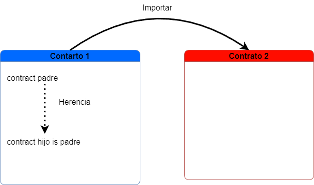

# Herencia

Permite tomar ciertas variables y funciones para un nuevo contrato contrato (contrato hijo) desde un contrato ya implementado (contrato padre)

Para definir la herencia debemos hacer lo siguiente

```solidity
//definimos contrato padre
contract contratoPadre
{
    ...
}
//definimos contrato hijo donde se hara la herencia
contract contratoHijo is contratoPadre
{
    ...
}
```

debemos recordar que las variables o funciones de tipo `private` no permite la herencia, en cambio el modificador de tipo `public` permite la herencia y aparecen en la interfaz mientras que el modificador `internal` no aparecerá en la interfaz, sin embargo permite la herencia de padre a hijo

# Importar

Debemos siempre tener en cuenta las diferencias entre herencia e importar, si bien la herencia permite interactuar con varios contratos en un mismo documento, importar permite la interacción de varios contratos en uno o mas documentos



Podemos importar de varias maneras, ya sea de manera local, como repositorios NPM, IPFS, entre otros.

```solidity
//esqueleto general 
import "lugar";
//importar de manera local
import "./documento2.sol";
//importar desde repositorio de github
import "https://github.com/OpenZeppelin/openzeppelin-contracts/blob/v2.5.0/contracts/math/SafeMath.sol";
//importar desde IPFS
import 'ipfs://Qmdyq9ZmWcaryd1mgGZ4PttRNctLGUSAMpPqufsk6uRMKh';
//importgar desde NPM
import "@openzeppelin/contracts/token/ERC20/ERC20.sol";
```

También podemos especificar que contrato queremos importar usando la siguiente sintaxis

```solidity
import (contratos) from "./lugar.sol";
```

# Librerías

Cuando tenemos un proyecto muy grande muchas veces ciertos algoritmos se encontraran en común, ya sea alguna transacción, función matemática, etc. para ello las librerías son una buena manera de poder controlar estas acciones haciéndolo mas modular, podemos llamar a estas desde el documento o desde otros documentos

```solidity
//importamos la libreria si esta fuera del documento 
import nombreLibreria from "./nombreDeArchivo.sol";


//definimos la libreria si lo hacemos desde el mismo documento
library nombreLibreria
{
    ...
}


//Definimos la libreria por su nombre y tipo
using nombreLibreria for tipoDeDato;
```

Si la librería permite usar en cualquier tipo de dato debemos especificar `tipoDeDato` con `*`

Ejemplo:

```solidity
// SPDX-License-Identifier: MIT
pragma solidity >=0.4.0 <0.7.0;

library Operaciones
{
    function dividir(uint _i, uint _j) public pure returns(uint)
    {
        require(_j>0, "no se puede dividir por 0");
            return _i / _j;
    }
    function multiplicar(uint _i, uint _j) public pure returns(uint)
    {
        if ( _i==0 || _j==0 )
        {
            return 0;
        }
        else
        {
            return _i*_j;
        }
    }
}

contract calculo 
{
    using Operaciones for uint;

    function calculos(uint _a, uint _b) public pure returns(uint,uint)
    {
        uint q = _a.dividir(_b);
        uint m = _a.multiplicar(_b);

        return (q,m);
    }
}
```

# Interfaz

Una interfaz nos sirve para que dos contratos que son de diferente dueño (conforme su dirección) que ya estas en la blockchain se comuniquen

```solidity
contract nombreInterfaz
{
    //declaramos las funciones que queremos interactuar
    function nombreFuncion ...;
}
```

para poder hacer uso de las interfaz  debemos declarar lo siguiente 

```solidity
//Declarar un puntero que apunte al otro contrato
nombreInterfaz nombrePuntero = nombreInterfaz(direccionContrato);
/*
Usar el puntero para usar las funcionalidades del otro contrato
definidas por la interfaz
*/
nombrePuntero.funcion(parametros);
```


