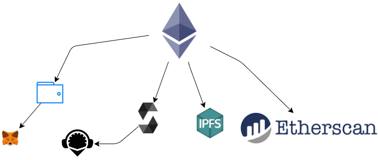

# Cosas necesarias para de desarrollo de contratos inteligentes en  Etehreum
- Lenguaje de desarrollo: solidity
- Wallet: MetaMask, Exodus, etc.
- Entorno de desarrollo (IDE): Remix IDE
- Sistema de almacenamiento: InterPlanetary File System (IPFS)
- Etherscan: para visualizar transacciones, bloques y mineros

# Solidity  
Solidity es un lenjuaje de alto nivel enfocado a contratos inteligentes. Su sintaxis es similar a JavaScript y está enfocado específicamente a la Máquina Virtual de Etehreum (EVM).
Solidity está tipado de manera estática y acepta, entre otras cosas, herencias, librerías y tipos complejos definidos por el usuario.
Como verá, es posible crear contratos para votar, para el crowdfunding, para subastas a ciegas, para monederos muti firmas, y mucho más.
# Primeros pasos de desarrollo
## Versión del compilador
`pragma solidity <version>;`
Con este definimos el tipo de version que se compilara el contrato, este es de suma importancia ya que algunas versiones de compilacion de solidity pueden hacer que el contrato actué de una manera inesperada afectando las transacciones del sistema 
Existen dos maneras de declarar la version
`pragma solidity ^0.4.0;`
Este define que la version de compilación debe se mayor o igual a la indicada en hasta x.x.9
`pragma solidity >=0.4.0 <0.7.0;`
Definimos un rango especifico del compilado del sistema
