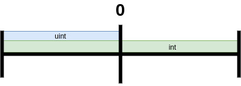

# Tipos de variables y operadores

como javascript la declaración de variables en solidity se conforma de la siguiente manera

```solidity
//declaracion de variables
<tipo de dato> <nombre de variable>;
//inizializacion de variable 
<tipo de dato> <nombre variable> = <valor>;
```

## Variables enteras

Existen dos tipos de enteros, con signo `int` y sin signo `uint`

Las mas usadas en contratos inteligentes son las sin signo, la diferencia con `int` y `unit` es que `int` abarca tanto los positivos como los negativos, y `uint` abarca solo los positivos



también a estas podemos especificar los bits de la variable, es decir esto lo podemos hacer de la siguiente manera 

```solidity
int<X> <variable>;

uint<X> <variable>;
```

Siendo _X_ el numero de bits, este puede variar de 8 a 256 **en múltiplos de 8**, por defecto solidity asigna 256 bits si no se especifica

## Variables string

Las strings que se crean son del tipo UTF-8

```solidity
string <nombre variable>;
string <nombre variable> = "texto";
```

hay ciertos caracteres especiales en solidity cuando se trata de strings y estos son

| carácter | función                                           |
|:--------:| ------------------------------------------------- |
| \n       | Inicia nueva linea                                |
| \\\      | Agrega \ al texto                                 |
| \'       | Agrega camilla simple al texto                    |
| \"       | Agrega camilla al texto                           |
| \b       | Agrega "Backspace"                                |
| \f       | Agrega salto de pagina                            |
| \r       | Agrega salto de linea                             |
| \t       | Agrega tabulación                                 |
| \v       | Agrega tabulación vertical                        |
| \xNN     | Representa el valor de un carácter en Hexagesimal |
| \uNNN    | Representa el valor de un carácter en UTF-8       |

## Variables booleanas

Estas son semejantes a javascript, se declaran de la siguiente manera

```solidity
bool <nombre_var> = true;
bool <nombre_var> = false;
```

## Variables bytes o byte

Estas almacenan bytes o bytes, se declaran de la siguiente manera

```solidity
//siendo x la cantidad de bytes almacenados
bytes<X> <nombre_var>;
bite <nombre_var>; //para almacenar un solo byte
```

`bytes` permite almacenar de 1 a 32 bytes en un intervalo de 1 unidad

`byte` solo permite almacenar un único byte

## Variable address

Permite almacenar la dirección de la cuenta 

```solidity
address <nombre_var>;
```

## Variables enums

Son una manera de que el usuario pueda crear su propio tipo de datos

```solidity
enum nombre_enumeracion 
{
    valores_enumeracion1, ... ,valor enumeracionN
}
```

Como declarar una variable tipo `enum`

```solidity
//como invocarlo
nombre_enumeracion ;
```

Existen dos maneras de modificar este tipo de variables

Especificando la opción de `enum`

```solidity
<nombre_variable> = <nombre_enumeracion>.<valor_enumeracion>
```

Usando el indice

```solidity
<nombre_variable> = <nombre_enumeracion>( <posicion> );
```

Ejemplo:

```solidity
enum estado {ON,OFF}   
/* recordar que 
    ON  es el indice 0
    OFF es el indice 1
*/
    estado interruptor;

    function encender() public
    {
        interruptor = estado.ON;
    }

    function accion(uint _k) public 
    {
        interruptor = estado(_k);
    }

    function devolverDatos() public view returns(estado)
    {
        return interruptor;
    }
```

## Unidades de tiempo

Estos se trabajan por enteros (`uint`) y el tiempo se cuenta por segundos, es decir si declaramos 1 minuto se almacena como 60 segundos

```solidity
 uint segundos = 1 seconds;
 uint minutos = 1 minutes;
 uint horas = 1 hours;
 uint dias = 1 days;
 uint semanas = 1 weeks;
 uint annos = 1 years;
```

Podemos combinar el uso de `now` con las unidades de tiempo, recordar que saldrá como resultado el timestamp en el horario de Unix

```solidity
function MasSemanas() public view returns(uint)
{
       return now + 1 weeks;
}
```

## Casteo de variables

Este nos sirve para transformar variables de un bit a otro tipo de bit de casi cualquier tipo de variable y/o transformar de una variable a otra

el pseudocodigo es asi

```pcode
uint<Y> ( uint<X> varTransformar ); 
```

Siendo *X* y *Y* los bits

Ejemplo

```solidity
uint8 entero8Bits = 42;
uint64 entero64Bits = 6000;
uint enteroNormal = 1000000;

int16 enteroCnSigno16bits = 156;    
int120 enteroCnSigno120bits = 900000;
int enteroCnSignoNormal = 5000000;

uint64 public casteoUno     = uint64(entero8Bits);
uint64 public casteoDos     = uint64(enteroCnSignoNormal);
uint8  public casteoTres    = uint8 (enteroCnSigno16bits);
int    public casteoCuatro  = int   (enteroNormal);
int    public casteoCinco   = int   (entero64Bits);
```

## Modificadores

Estos declaran los permisos y privilegios  del comportamientp de una variable o funcion

El pseudocodigo se muestra de esta manera

```solidity
<tipoDeDato> [modificador] <nombreDeVariable>;
```

### modificador _public_

Son visibles para todos los usuarios y contratos en la cadena, es decir que son accesibles para lectura y escritura por cualquier usuario y/o contrato

Ejemplo:

```solidity
int8 public edad = 28;
string public nombre = "Cosme Fulanito";
```

### modificador private

Este modificador solo puede leer/escrbir solo dentro del contrato que las define. No puede aaceder a ellas un usuario o contrato externo

Ejemplo:

```solidity
contract contratoEjamplo 
{
    address private usuarioInteraccion;
}
```

### modificador internal

Similar a `private` pero cualquier otro contrato puede verlas, se crea una herencia donde el contrato padre hereda las variables y/o funciones del contrato hijo accediendo a estas, pero no fuera del contrato padre

Para poder comprender los tipos de permisos de lectura/escritura podemos referirnos a esta tabla 

| Modificador  | Contrato mismo | Usuario/Otros contratos | Contrato hijo |
|:------------:|:--------------:|:-----------------------:|:-------------:|
| **public**   | ✔️             | ✔️                      | ✔️            |
| **internal** | ✔️             | ❌                       | ❌             |
| **private**  | ✔️             | ❌                       | ✔️            |

## Modificador de memoria

En solidity hay dos lugares donde puedes guardar ya sea de manera permanente o temporal, por lo general solidity pone por defecto el almacenar de manera permanente solo si no están almacenadas en alguna `function` mientras que las que están almacenadas en algún `function` ya sea de manera común o anidada se guardan de manera temporal. Podemos controlar como se almacenan estas variables usando los modificadores correspondientes

### modificador memory

Este tipo de modificador almacena los datos de manera temporal

### modificador storage

Este tipo de variable se guarda de manera permanente en la red de blockchain
